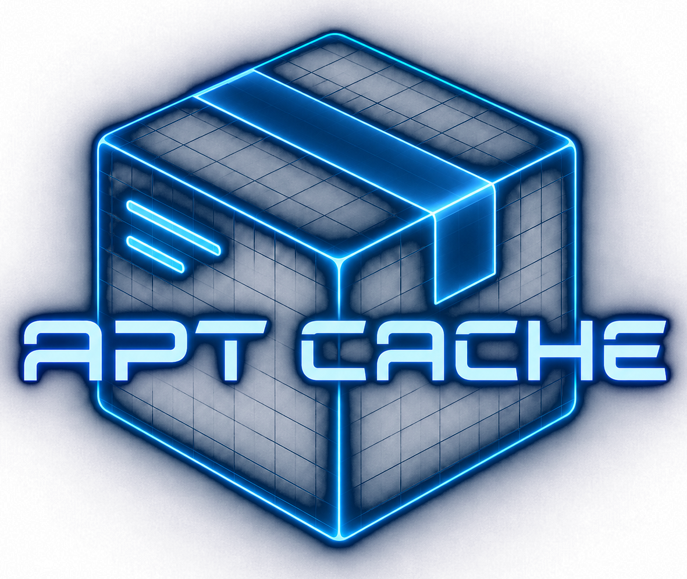

 Cache APT Packages Action v2 :: FAQ

## Why did you create a new version?

### Bash Scripts

Bash shell scripting grew in complexity and became very unreadable. The action needed higher level language
idioms like:

- arrays, map handling, complex pattern matching, and complex text processing;
- robust logging, debugging, other instrumentations; and
- avoiding cryptic shell and system environment considerations.

The lack of these 

### Language Choice

Languages like Python, Go, Rust, etc. have performance and writeability trade offs that would also meet these
requirements, but ultimately Typescript was chosen because it:

- is the most performant and well supported for GitHub actions;
- has native strongly typed libraries for actions maintained by GitHub like
  - [`@actions/core`](https://github.com/actions/toolkit/tree/main/packages/core) for runtime environment, and
  - other common services like [`@actions/cache`](https://github.com/actions/toolkit/tree/main/packages/cache)
    and [`@actions/artifact`](https://github.com/actions/toolkit/tree/main/packages/artifact);
- requires no binary compilation;
- provides a balance of code comprehension and performance for contributors; and
- allows for better continuous integration, release workflow, hermetic unit testing, and smoke testing.

## Where did all the APT functionality go?

Since this has been a complex part of the codebase, I decided to separate the concern as its own library. This
can now be found at [`npm/ts-apt`](https://www.npmjs.com/package/ts-apt) with the sourcecode in the
[`awalsh128/ts-apt`](http://github.com/awalsh128/ts-apt) repository.

For ease of use there is an option to bring in the workspace for inline source via `npm run dev:tsapt:[un]link`
so it can be debugged and then PR'd to the [awalsh128/ts-apt](http://github.com/awalsh128/ts-apt)
repository.

## How do I start using this?

> [!IMPORTANT]
> This is in the early phase of development. Use at your own risk!

**No change is needed and the action signatures are backwards compatible.**

- Just change to the latest `v2.*` in your GitHub workflow.
- `v1.*` will still get patch updates but is in maintenance mode.

## Some internal changes

- Logging uses native GitHub calls that will result in run annotations.
- Output will tend to be more verbose but this will be tuned as this version matures.
- All the metadata generated like manifests, the cache key, and logs are now stored as artifacts.
- Debug mode can either be specified via an input parameter `debug` or [as part of the repository settings](https://docs.github.com/en/actions/how-tos/monitor-workflows/enable-debug-logging).
